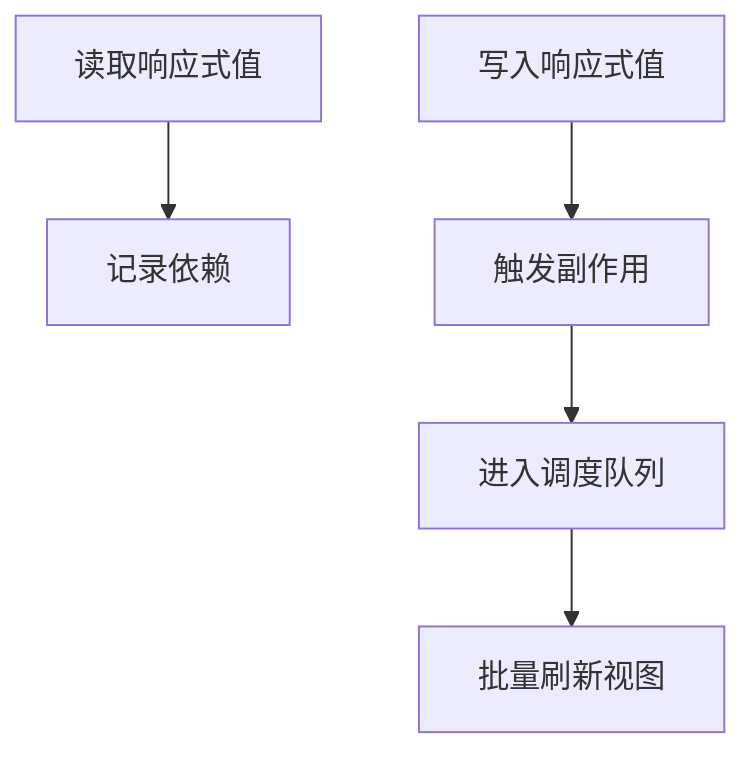

# Vue 3 响应式与调度：一次更新为什么不会立刻触发十次渲染

> 这是一篇通过 Own-Web Visual Blocks 编辑器创建的技术教程。示例以 Vue 3 Composition API 为主，重点讨论依赖追踪、批量更新与调度边界。

## 先把“响应式”拆成三个动作

在一个表格里，单元格 A2 依赖 A0 与 A1；当任意依赖变化，A2 会重新计算。Vue 3 把这个直觉拆成三层：读取时建立依赖，写入时触发依赖，调度器决定副作用何时运行。`ref()` 适合包装单值，`reactive()` 适合对象和集合，但两者都不是魔法，它们都需要一个可以被追踪的访问路径。

```typescript
import { ref, computed, watchEffect, nextTick } from 'vue'

const count = ref(0)
const doubled = computed(() => count.value * 2)
watchEffect(() => console.log('render-like effect', doubled.value))
count.value++
await nextTick()
```

代码的关键不是 `count.value++` 本身，而是读取 `doubled.value` 时将当前 effect 放进依赖集合。写入发生后，依赖集合收到通知；多个同步写入可以合并到同一轮更新里，避免每次赋值都重新计算整个组件树。

## 依赖追踪：从 Proxy 到 effect

`reactive()` 返回 Proxy。Proxy 的 get trap 可以记录当前 active effect，set trap 可以找到对应依赖并触发。一个最小模型可以写成下面的 Mermaid 图：



### 为什么需要调度

假设一个事件处理器连续改变三个字段。如果每次写入都同步执行 watcher，用户会看到重复计算，组件也可能在中间状态下读取到不完整数据。调度器把 effect 放入队列，使用微任务在当前同步任务结束后统一 flush。这个时间点就是 `nextTick()` 有用的地方：它让我们等待当前更新队列完成，而不是猜一个 setTimeout 延时。

| 操作 | 是否建立依赖 | 是否触发调度 | 常见用途 |
| --- | --- | --- | --- |
| 读取 ref.value | 是 | 否 | computed / template |
| 写入 ref.value | 否 | 是 | 用户交互、请求结果 |
| computed 求值 | 记录上游依赖 | 标记失效 | 派生状态 |
| nextTick | 否 | 等待队列 | 读取更新后的 DOM |

## 队列、去重和可观察边界

调度队列至少需要两个性质。第一，重复加入同一个 job 时要去重；第二，flush 期间新加入的 job 不能破坏当前遍历。实际框架会使用稳定的 job 身份、队列索引和递归保护。应用层不应依赖这些内部字段，而应把它当成一个契约：同步状态变化会在可预测的异步边界后反映到 DOM。

一个常见错误是把昂贵工作直接写入 `watchEffect`，然后在 effect 内再次写入它依赖的值，形成循环。另一个错误是把所有对象都做深层 watch，导致输入一个字符便扫描大树。更好的方式是选择明确的 getter，只观察真正影响副作用的字段，并在异步任务中注册清理函数。

## 实战：搜索框的可取消调度

搜索输入应当先更新本地状态，再等待用户停顿，最后发请求。请求开始后，旧请求需要取消或忽略，避免慢响应覆盖新结果。一个稳定的实现通常包含 debounce、请求序列号和 onInvalidate 三层保护。

```typescript
watch(query, async (value, _old, onInvalidate) => {
  const requestId = ++latestRequest
  let cancelled = false
  onInvalidate(() => { cancelled = true })
  await wait(240)
  const result = await fetchResults(value)
  if (!cancelled && requestId === latestRequest) results.value = result
})
```

这里的“调度”不只是性能优化，也是正确性边界。网络请求、组件卸载、路由离开和用户再次输入都可能改变副作用是否仍然有效。把取消写进 watch 的生命周期，远比在各处维护布尔标志更容易审查。

## 给组件作者的检查清单

- 读取状态的地方是否真的需要响应式？
- 派生状态能否用 computed，而不是复制一份可变值？
- 写入是否会在同一个 tick 内重复触发昂贵副作用？
- 异步 watch 是否处理了过期响应和卸载？
- 是否用 nextTick 读取更新后的 DOM，而不是固定延迟？
- 调度队列是否有可见的 loading、失败和重试状态？

> Vue 官方资料将响应式、Proxy、依赖追踪和 scheduler 分开讨论。本文的模型是为了帮助排查问题，不把实现细节当作公共 API。

参考：[Vue Reactivity Fundamentals](https://vuejs.org/guide/essentials/reactivity-fundamentals.html)、[Reactivity in Depth](https://vuejs.org/guide/extras/reactivity-in-depth.html)、[Reactivity API: Core](https://vuejs.org/api/reactivity-core.html)。

